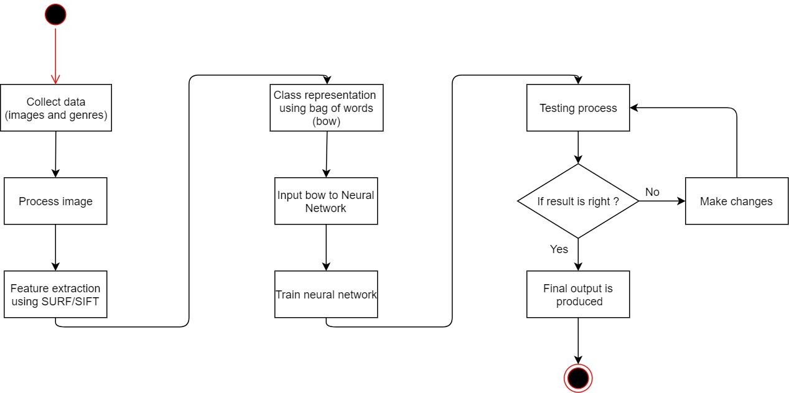
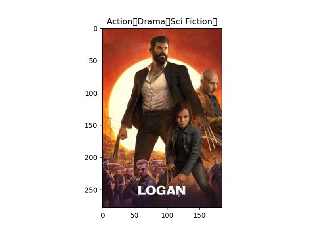
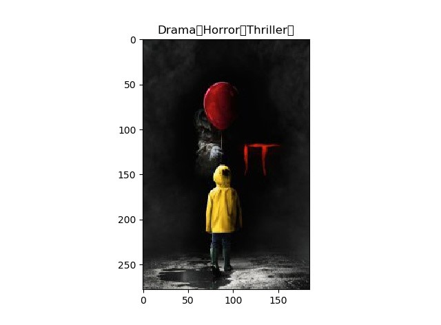

Judging a book by its cover is an old adage that warns against evaluating the merit of something based strictly on its outward appearances. However, taken literally, we set out to see if we can in fact judge a book by its cover, more specifically judge a movie by its poster.

This project presents a method for movie genre categorization of movie poster. Our approach decomposes each poster into feature and its descriptor and cluster this descriptors into Bag-of-Words (BOW). We approach the genre classification task by mapping BOW into movie genres like action, romance, comedy, drama or horror movies using learning algorithm.
On one hand we explored various algorithms like SIFT, SURF etc. for feature extraction and cluster them using K-Means algorithm to obtain Bag Of Words (BOW) from the object recognition of poster of the movie and on the other hand we tested various learning algorithm like Neural Network(NN), SVM etc. to obtain movie genre as output from this BOW.


### Implementation
#### 1. Feature Extraction
From the image of poster accepted, we extract features and their descriptors using local-feature algorithm like SIFT.
```
import cv2
import numpy as np
import matplotlib.pyplot as plt
from scipy import ndimage
from PIL import Image
import cv2

img = np.array(ndimage.imread("b.jpg", flatten=False))
BOW = cv2.BOWKMeansTrainer(10)
sift = cv2.xfeatures2d.SIFT_create()
kp,des = sift.detectAndCompute(img,None)
img2=cv2.drawKeypoints(img, kp, None,(0,255,0),4)
plt.imshow(img2)
plt.show()
```


#### 2. Generation of Bag-of-Words
After extraction of features, the system will detect the various objects present in the movie poster image and generate a Bag-of-Words using k-means clustering which will then be used for further processing. The bag-of-words model (BoW model) is to be applied to image classification, by treating image features as words. In document classification, a bag of words is a sparse vector of occurrence counts of words; that is, a sparse histogram over the vocabulary. In computer vision, a bag of visual words is a vector of occurrence counts of a vocabulary of local image features. Following is code snippet for implementing simple Bag-of-words from text file features.

#### 3. Prediction of Genre
We use Bag-of-Words to predict the genre of the poster using Neural Bag-of-Words model. The Neural Bag-of-Words (NBOW) model performs classification with an average of the input word vectors and achieves an impressive performance.






Developed by: [Akshat Barbhaya](https://www.linkedin.com/in/akshat-21/), [Karan Gada](https://www.linkedin.com/in/karan-gada-a1a56811b/), [Mahadevan Kounder](https://www.linkedin.com/in/mahadevan-kounder-9004b1110/)
